# Student Feedback Analysis Report

## EC Dept, Government Polytechnic Palanpur

*Generated on: March 17, 2024*

### Rating Scale

- **1 - Very Poor**
- **2 - Poor**
- **3 - Average**
- **4 - Good**
- **5 - Very Good**

### Assessment Parameters

- **Q1 Syllabus Coverage:** Has the Teacher covered entire Syllabus as prescribed by University/ College/ Board?  (શિક્ષક યુનિવર્સિટી/કૉલેજ / બોર્ડ દ્વારા સૂચિત અભ્યાસક્રમ સંપૂર્ણ આવરી લે છે ?)
- **Q2 Topics Beyond Syllabus:** Has the Teacher covered relevant topics beyond syllabus (શું શિક્ષક અભ્યાસક્રમ સુસંગત બહારના વિષયો આવરી લે છે?)
- **Q3 Pace of Teaching:** Pace on which contents were covered ( કોર્સ આવરી લેવાની ગતિ)
- **Q4 Practical Demo:** Support for the development of Students' skill (વિદ્યાર્થીઓના કૌશલ્યના વિકાસ માટે સપોર્ટ) Practical demonstration (પ્રેક્ટીકલ નિદર્શન)
- **Q5 Hands-on Training:** Support for the development of Students' skill (વિદ્યાર્થીઓના કૌશલ્યના વિકાસ માટે સપોર્ટ) Hands-on training
- **Q6 Technical Skills of Teacher:** Effectiveness of Teacher in terms of: Technical content/course content (ટેકનિકલ સામગ્રી / કોર્સ સામગ્રી)
- **Q7 Communication Skills of Teacher:** Effectiveness of Teacher in terms of: Communication skills (પ્રત્યાયન કૌશલ્ય)
- **Q8 Doubt Clarification:** Clarity of expectations of students (વિદ્યાર્થીઓની અપેક્ષાઓની સ્પષ્ટતા)
- **Q9 Use of Teaching Tools:** Effectiveness of Teacher in terms of: Use of teaching aids (શિક્ષણ માટે સહાયક સાધનોનો ઉપયોગ)
- **Q10 Motivation:** Motivation and inspiration for students to learn (વિદ્યાર્થીઓને શીખવા માટે પ્રોત્સાહન અને પ્રેરણા)
- **Q11 Helpfulness of Teacher:** Willingness to offer help and advice to students (વિદ્યાર્થીઓને મદદ અને સલાહ આપવા માટેની ઇચ્છા.)
- **Q12 Student Progress Feedback:** Feedback provided on Students' progress (વિદ્યાર્થીઓની પ્રગતિ પર પ્રતિભાવ આપ્યો છે)

### Year-Term Analysis

#### Odd - 2023

| Branch - Semester | Average Score |
|-------------------|---------------|
| EC - Sem 5 | 5.00 |
| EC - Sem 3 | 4.19 |
| EC - Sem 1 | 4.03 |
| ICT - Sem 3 | 4.58 |
| ICT - Sem 1 | 3.16 |
| IT - Sem 1 | 4.29 |

### Branch Analysis

| Branch | Overall Average | Q1 | Q2 | Q3 | Q4 | Q5 | Q6 | Q7 | Q8 | Q9 | Q10 | Q11 | Q12 |
|--------|-----------------|----|----|----|----|----|----|----|----|----|----|-----|-----|
| EC | 4.56 | 4.63 | 4.44 | 4.48 | 4.52 | 4.53 | 4.64 | 4.59 | 4.60 | 4.54 | 4.49 | 4.59 | 4.64 |
| ICT | 3.73 | 3.73 | 3.63 | 3.74 | 3.76 | 3.72 | 3.74 | 3.75 | 3.72 | 3.73 | 3.71 | 3.73 | 3.78 |
| IT | 4.19 | 4.26 | 4.16 | 4.21 | 4.20 | 4.12 | 4.31 | 4.23 | 4.21 | 4.18 | 4.04 | 4.19 | 4.17 |

### Subject Analysis

| Subject | Overall Average |
|---------|------------------|
| E&S (4300021) | 4.97 |
| ES (4351102) | 5.00 |
| MWR (4351103) | 4.98 |
| M&WC (4351104) | 5.00 |
| SP (4351105) | 5.00 |
| OPP (4351108) | 5.00 |
| PR1 (4351107) | 5.00 |
| ECN (4331101) | 4.52 |
| EMI (4331102) | 3.78 |
| IE (4331103) | 4.19 |
| PEC (4331104) | 4.61 |
| PC (4331105) | 4.19 |
| FE (4311102) | 4.92 |
| FEE (4311101) | 4.94 |
| BICT (4300010) | 3.93 |
| S&Y (4300015) | 4.29 |
| CE (1333201) | 4.09 |
| MPMC (1333202) | 4.15 |
| DSA (1333203) | 4.33 |
| DBMS (1333204) | 4.35 |
| OSA (1333205) | 4.58 |
| EEE (1313202) | 3.94 |
| WDP (1313203) | 3.64 |
| FICT (1313201) | 3.40 |
| PP (4311601) | 4.43 |
| SWD (4311603) | 4.36 |
| IIS (4311602) | 4.02 |

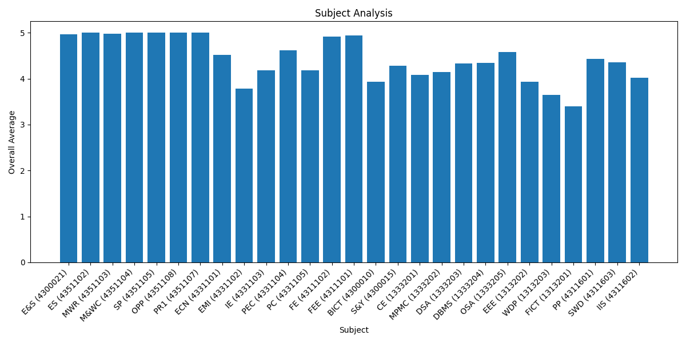

### Faculty Analysis

#### Mr. S P Joshiara

- Overall Average: 3.54
| Subject | Average Score |
|---------|---------------|
| E&S (4300021) | 4.97 |
| EMI (4331102) | 3.78 |
| FICT (1313201) | 3.14 |
| S&Y (4300015) | 4.29 |

#### Ms. M K Pedhadiya

- Overall Average: 4.08
| Subject | Average Score |
|---------|---------------|
| ES (4351102) | 5.00 |
| PC (4331105) | 4.19 |
| DBMS (1333204) | 4.35 |
| WDP (1313203) | 3.82 |

#### Mr. R C Parmar

- Overall Average: 3.95
| Subject | Average Score |
|---------|---------------|
| MWR (4351103) | 4.98 |
| IE (4331103) | 4.19 |
| WDP (1313203) | 3.47 |
| SWD (4311603) | 4.36 |

#### Mr. L K Patel

- Overall Average: 4.71
| Subject | Average Score |
|---------|---------------|
| M&WC (4351104) | 5.00 |
| OPP (4351108) | 5.00 |
| FE (4311102) | 4.92 |
| OSA (1333205) | 4.58 |
| IIS (4311602) | 4.63 |

#### Mr. R N Patel

- Overall Average: 3.97
| Subject | Average Score |
|---------|---------------|
| SP (4351105) | 5.00 |
| ECN (4331101) | 4.52 |
| BICT (4300010) | 4.67 |
| EEE (1313202) | 3.94 |
| FICT (1313201) | 3.65 |

#### Mr. M J Dabgar

- Overall Average: 4.46
| Subject | Average Score |
|---------|---------------|
| PR1 (4351107) | 5.00 |
| DSA (1333203) | 4.33 |
| PP (4311601) | 4.43 |

#### Mr. S J Chauhan

- Overall Average: 4.28
| Subject | Average Score |
|---------|---------------|
| PEC (4331104) | 4.61 |
| CE (1333201) | 4.09 |

#### Mr. N J Chauhan

- Overall Average: 4.08
| Subject | Average Score |
|---------|---------------|
| FEE (4311101) | 4.94 |
| MPMC (1333202) | 4.15 |
| S&Y (4300015) | 3.75 |
| IIS (4311602) | 4.41 |

#### Mr. M J Vadhwania

- Overall Average: 3.15
| Subject | Average Score |
|---------|---------------|
| BICT (4300010) | 3.19 |
| S&Y (4300015) | 4.03 |
| IIS (4311602) | 3.03 |

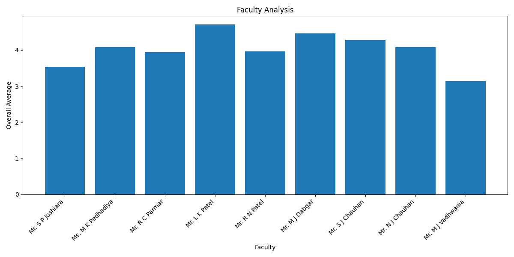

### Parameter-wise Analysis

#### Parameter-wise Branch Analysis

| Branch | Q1 | Q2 | Q3 | Q4 | Q5 | Q6 | Q7 | Q8 | Q9 | Q10 | Q11 | Q12 |
|----------|----|----|----|----|----|----|----|----|----|-----|-----|-----|
| EC | 4.63 | 4.44 | 4.48 | 4.52 | 4.53 | 4.64 | 4.59 | 4.60 | 4.54 | 4.49 | 4.59 | 4.64 |
| ICT | 3.73 | 3.63 | 3.74 | 3.76 | 3.72 | 3.74 | 3.75 | 3.72 | 3.73 | 3.71 | 3.73 | 3.78 |
| IT | 4.26 | 4.16 | 4.21 | 4.20 | 4.12 | 4.31 | 4.23 | 4.21 | 4.18 | 4.04 | 4.19 | 4.17 |

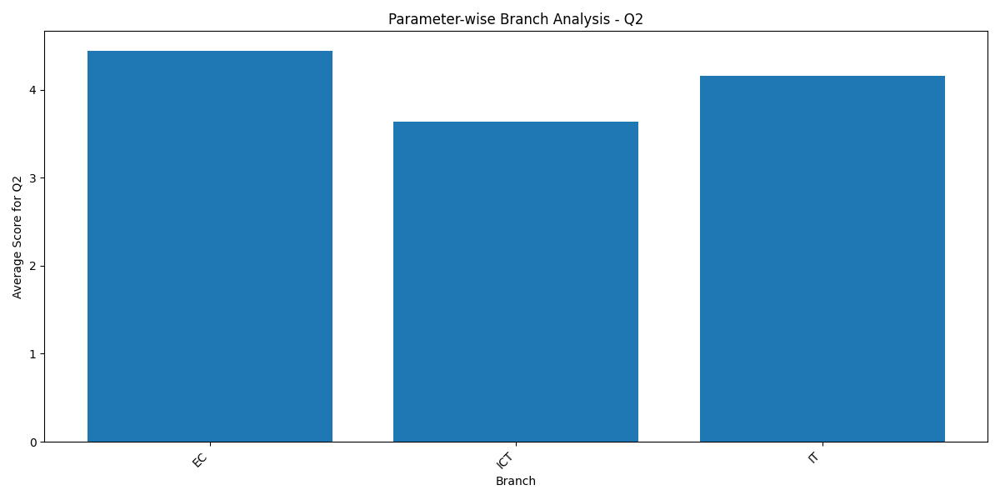

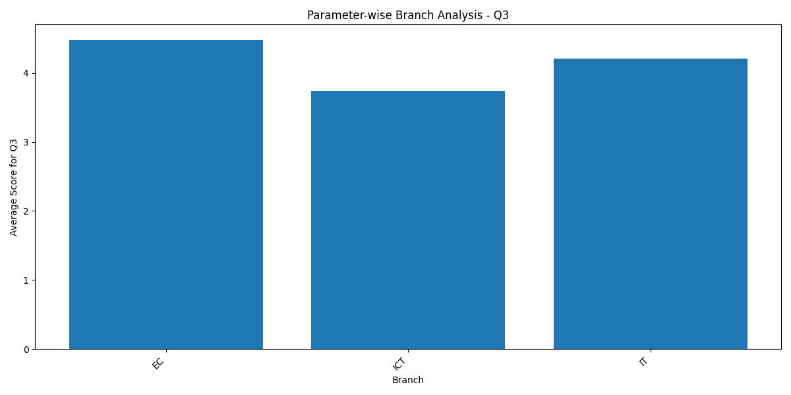

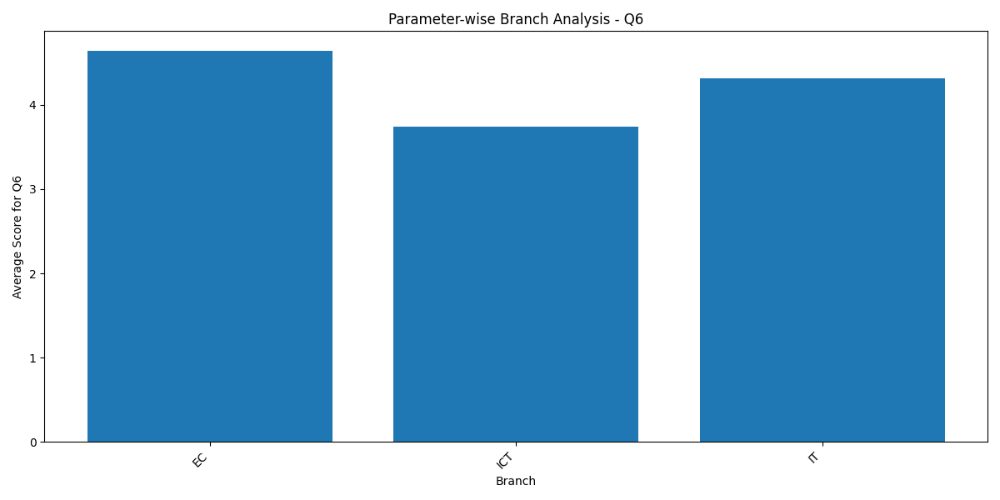

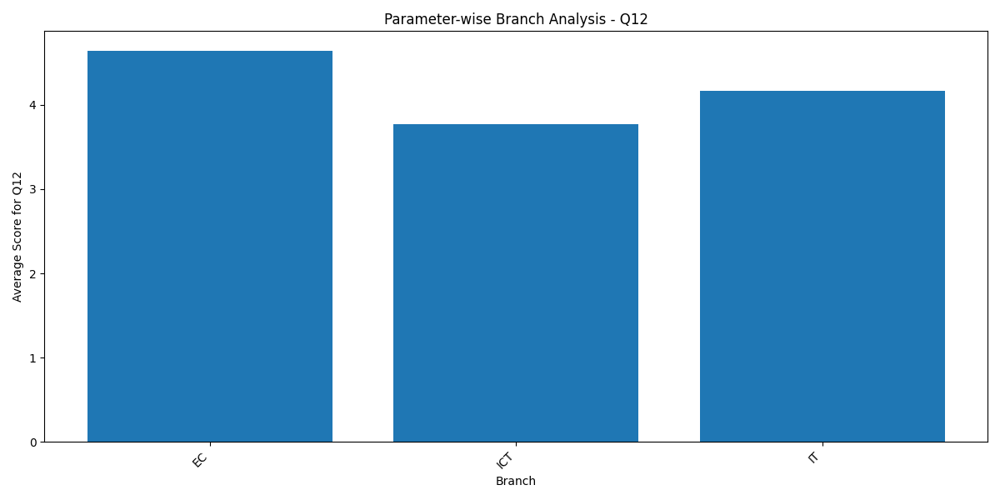

#### Parameter-wise Subject Analysis

| Subject | Q1 | Q2 | Q3 | Q4 | Q5 | Q6 | Q7 | Q8 | Q9 | Q10 | Q11 | Q12 |
|----------|----|----|----|----|----|----|----|----|----|-----|-----|-----|
| E&S (4300021) | 5.00 | 5.00 | 5.00 | 5.00 | 4.80 | 5.00 | 5.00 | 4.80 | 5.00 | 5.00 | 5.00 | 5.00 |
| ES (4351102) | 5.00 | 5.00 | 5.00 | 5.00 | 5.00 | 5.00 | 5.00 | 5.00 | 5.00 | 5.00 | 5.00 | 5.00 |
| MWR (4351103) | 5.00 | 5.00 | 5.00 | 5.00 | 5.00 | 5.00 | 5.00 | 5.00 | 5.00 | 5.00 | 5.00 | 4.80 |
| M&WC (4351104) | 5.00 | 5.00 | 5.00 | 5.00 | 5.00 | 5.00 | 5.00 | 5.00 | 5.00 | 5.00 | 5.00 | 5.00 |
| SP (4351105) | 5.00 | 5.00 | 5.00 | 5.00 | 5.00 | 5.00 | 5.00 | 5.00 | 5.00 | 5.00 | 5.00 | 5.00 |
| OPP (4351108) | 5.00 | 5.00 | 5.00 | 5.00 | 5.00 | 5.00 | 5.00 | 5.00 | 5.00 | 5.00 | 5.00 | 5.00 |
| PR1 (4351107) | 5.00 | 5.00 | 5.00 | 5.00 | 5.00 | 5.00 | 5.00 | 5.00 | 5.00 | 5.00 | 5.00 | 5.00 |
| ECN (4331101) | 4.50 | 4.12 | 4.50 | 4.62 | 4.38 | 4.50 | 4.75 | 4.50 | 4.50 | 4.38 | 4.88 | 4.62 |
| EMI (4331102) | 3.88 | 3.50 | 3.50 | 3.25 | 3.62 | 3.88 | 4.25 | 4.00 | 4.00 | 3.50 | 4.00 | 4.00 |
| IE (4331103) | 4.50 | 3.88 | 4.12 | 4.25 | 4.50 | 4.75 | 4.00 | 4.38 | 4.00 | 3.62 | 4.12 | 4.12 |
| PEC (4331104) | 4.75 | 4.12 | 4.50 | 4.75 | 4.62 | 4.62 | 4.62 | 4.75 | 4.62 | 4.50 | 4.62 | 4.88 |
| PC (4331105) | 4.38 | 4.12 | 4.25 | 4.12 | 3.88 | 4.38 | 4.12 | 4.00 | 4.00 | 4.38 | 4.12 | 4.50 |
| FE (4311102) | 5.00 | 5.00 | 4.33 | 5.00 | 4.67 | 5.00 | 5.00 | 5.00 | 5.00 | 5.00 | 5.00 | 5.00 |
| FEE (4311101) | 5.00 | 5.00 | 4.67 | 5.00 | 5.00 | 5.00 | 5.00 | 5.00 | 5.00 | 4.67 | 5.00 | 5.00 |
| BICT (4300010) | 3.83 | 4.00 | 3.50 | 3.83 | 4.33 | 4.00 | 3.67 | 4.17 | 4.00 | 4.00 | 3.83 | 4.00 |
| S&Y (4300015) | 3.71 | 3.65 | 3.69 | 3.65 | 3.63 | 3.70 | 3.71 | 3.70 | 3.67 | 3.72 | 3.61 | 3.68 |
| CE (1333201) | 4.07 | 3.57 | 4.07 | 4.21 | 4.29 | 4.14 | 4.21 | 4.07 | 3.93 | 4.14 | 4.14 | 4.21 |
| MPMC (1333202) | 4.00 | 4.14 | 3.79 | 4.14 | 4.21 | 4.07 | 4.36 | 4.29 | 4.14 | 4.14 | 4.21 | 4.29 |
| DSA (1333203) | 4.07 | 3.86 | 4.36 | 4.50 | 4.43 | 4.14 | 4.50 | 4.29 | 4.43 | 4.64 | 4.36 | 4.43 |
| DBMS (1333204) | 4.07 | 3.86 | 4.21 | 4.36 | 4.36 | 4.36 | 4.21 | 4.36 | 4.57 | 4.57 | 4.57 | 4.64 |
| OSA (1333205) | 4.43 | 4.43 | 4.86 | 4.64 | 4.64 | 4.43 | 4.50 | 4.57 | 4.64 | 4.50 | 4.50 | 4.79 |
| EEE (1313202) | 4.06 | 3.91 | 3.91 | 4.00 | 3.91 | 4.03 | 3.94 | 3.82 | 4.03 | 3.76 | 4.03 | 3.82 |
| WDP (1313203) | 3.62 | 3.59 | 3.69 | 3.66 | 3.57 | 3.66 | 3.62 | 3.69 | 3.60 | 3.60 | 3.72 | 3.71 |
| FICT (1313201) | 3.49 | 3.38 | 3.46 | 3.43 | 3.35 | 3.47 | 3.40 | 3.35 | 3.34 | 3.32 | 3.34 | 3.44 |
| PP (4311601) | 4.65 | 4.43 | 4.48 | 4.35 | 4.43 | 4.52 | 4.43 | 4.39 | 4.48 | 3.87 | 4.57 | 4.52 |
| SWD (4311603) | 4.30 | 4.30 | 4.52 | 4.43 | 4.17 | 4.52 | 4.43 | 4.35 | 4.35 | 4.22 | 4.39 | 4.35 |
| IIS (4311602) | 4.12 | 4.01 | 3.99 | 4.07 | 4.00 | 4.14 | 4.09 | 4.06 | 3.99 | 3.94 | 3.93 | 3.94 |

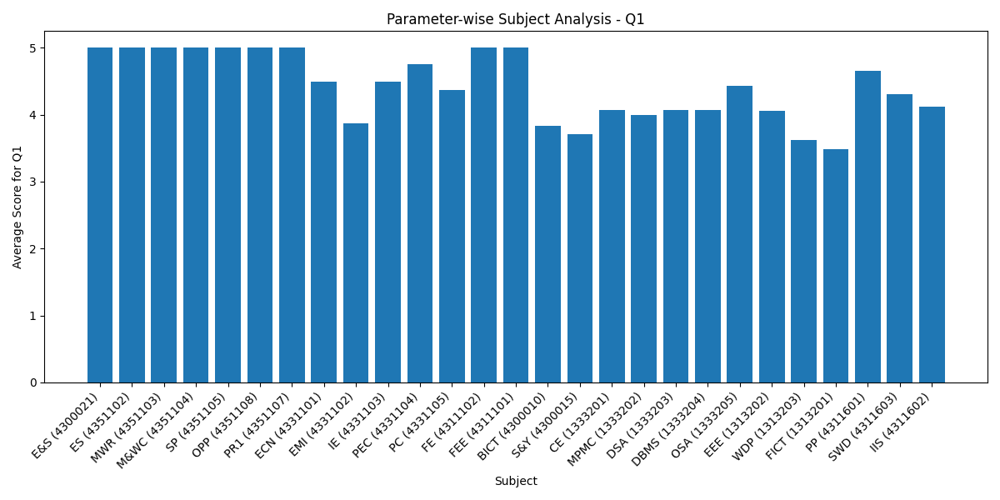

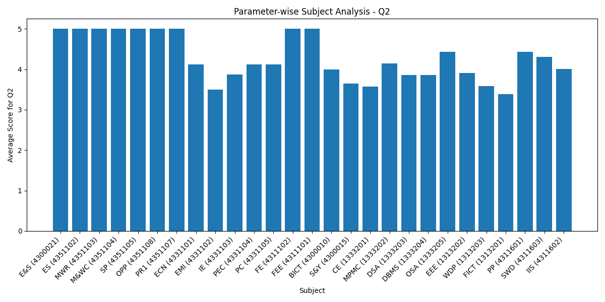

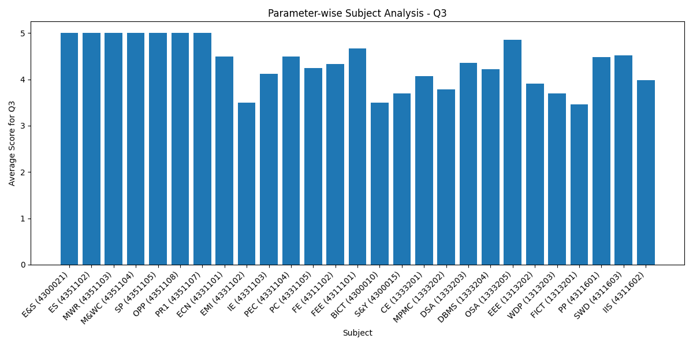

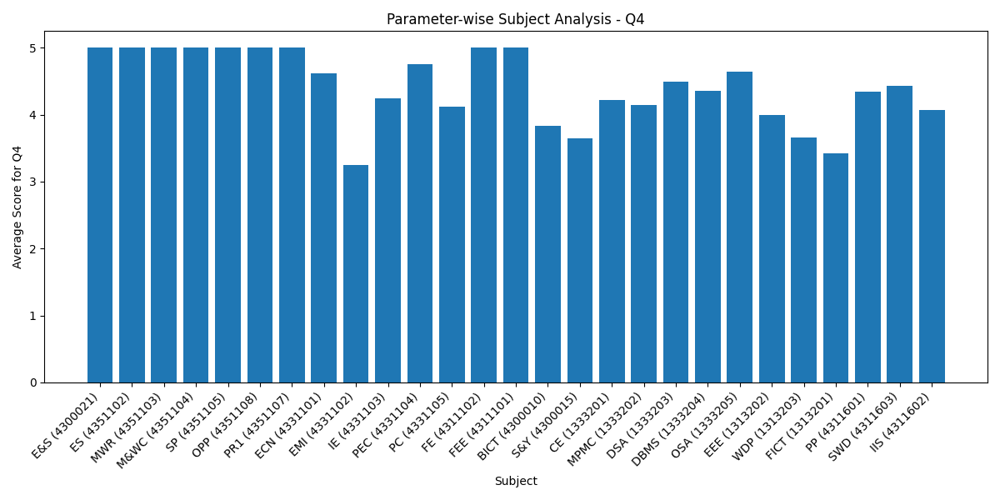

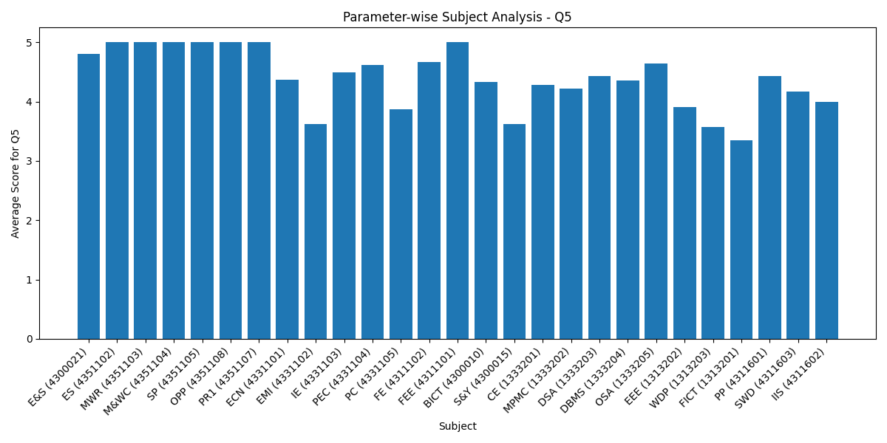

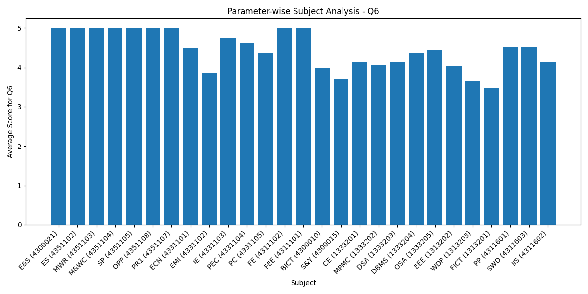

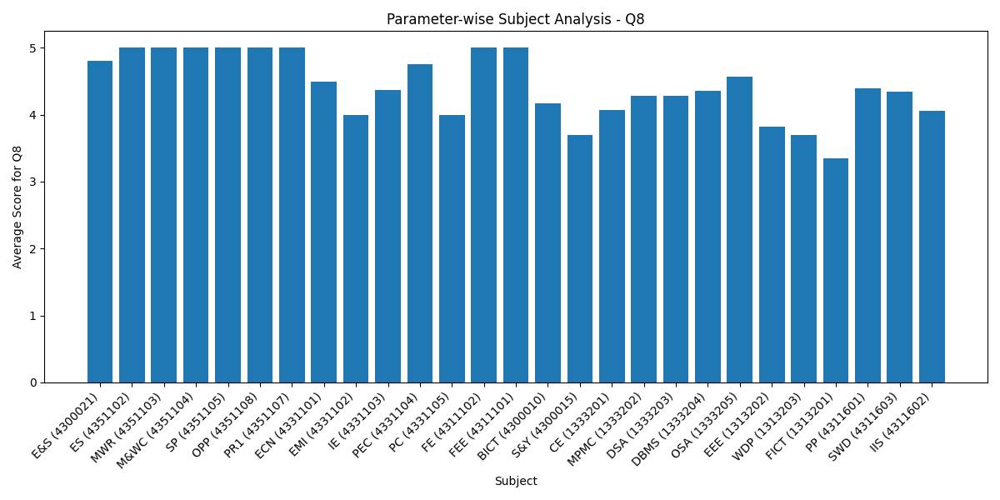

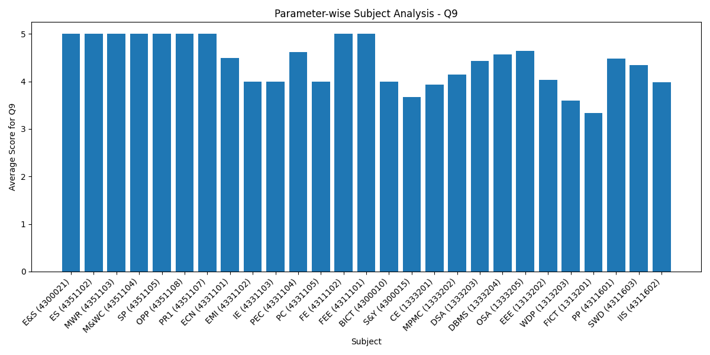

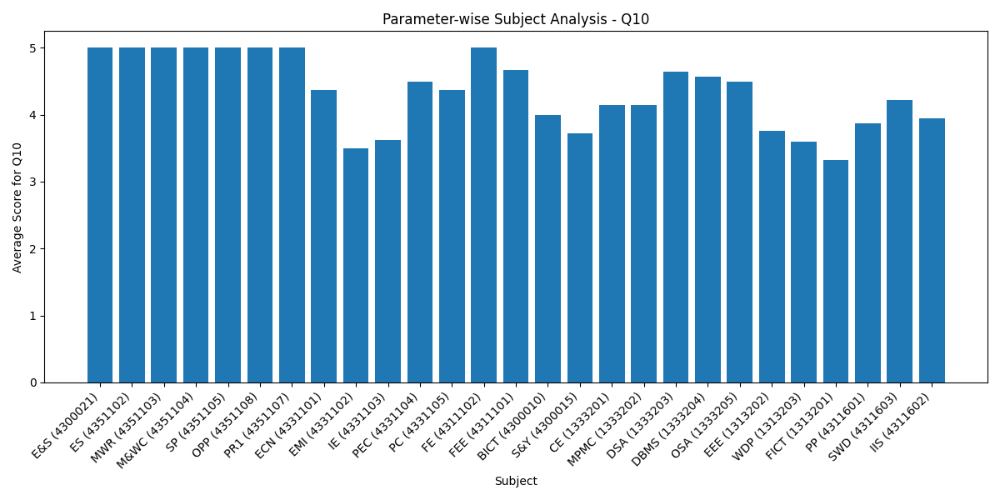

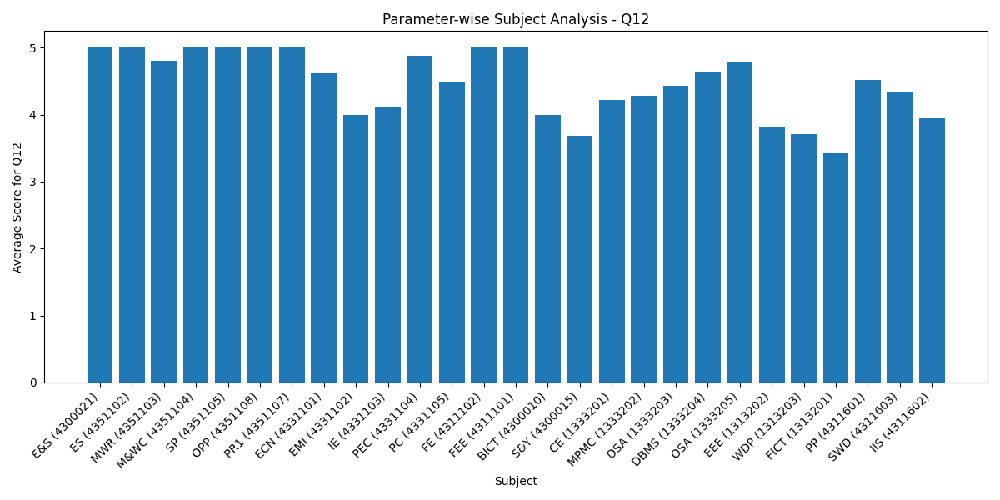

#### Parameter-wise Faculty Analysis

| Faculty | Q1 | Q2 | Q3 | Q4 | Q5 | Q6 | Q7 | Q8 | Q9 | Q10 | Q11 | Q12 |
|----------|----|----|----|----|----|----|----|----|----|-----|-----|-----|
| Mr. S P Joshiara | 3.59 | 3.48 | 3.54 | 3.51 | 3.49 | 3.58 | 3.58 | 3.55 | 3.52 | 3.50 | 3.56 | 3.57 |
| Ms. M K Pedhadiya | 4.07 | 3.85 | 4.11 | 4.10 | 4.00 | 4.08 | 4.05 | 4.08 | 4.08 | 4.18 | 4.20 | 4.21 |
| Mr. R C Parmar | 3.93 | 3.94 | 4.00 | 3.99 | 3.90 | 4.11 | 3.93 | 4.00 | 3.91 | 3.79 | 3.97 | 3.97 |
| Mr. L K Patel | 4.56 | 4.64 | 4.74 | 4.78 | 4.68 | 4.72 | 4.68 | 4.70 | 4.78 | 4.68 | 4.72 | 4.82 |
| Mr. R N Patel | 4.01 | 3.93 | 3.93 | 4.00 | 3.94 | 4.07 | 3.99 | 3.90 | 4.00 | 3.87 | 3.99 | 3.98 |
| Mr. M J Dabgar | 4.50 | 4.31 | 4.50 | 4.48 | 4.50 | 4.45 | 4.52 | 4.43 | 4.52 | 4.26 | 4.55 | 4.55 |
| Mr. S J Chauhan | 4.32 | 3.77 | 4.23 | 4.41 | 4.41 | 4.32 | 4.36 | 4.32 | 4.18 | 4.27 | 4.32 | 4.45 |
| Mr. N J Chauhan | 4.08 | 4.04 | 3.99 | 4.07 | 4.08 | 4.09 | 4.19 | 4.15 | 4.09 | 4.08 | 4.00 | 4.08 |
| Mr. M J Vadhwania | 3.66 | 3.28 | 3.21 | 3.14 | 3.10 | 3.24 | 3.21 | 3.21 | 2.93 | 3.03 | 2.86 | 2.90 |

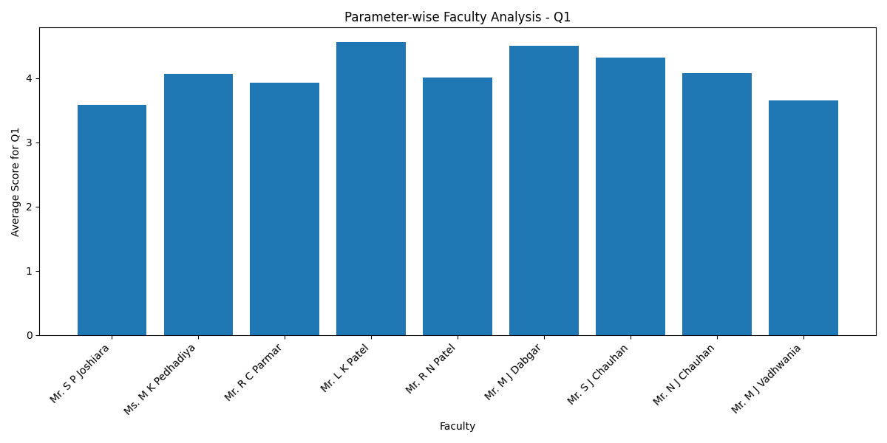

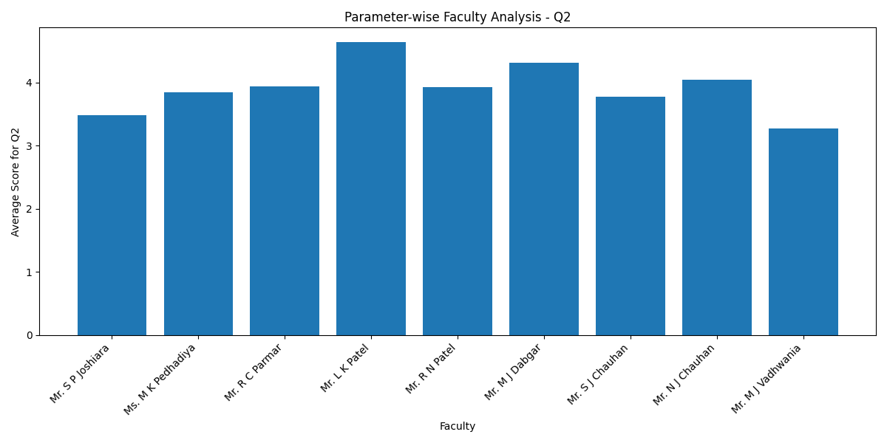

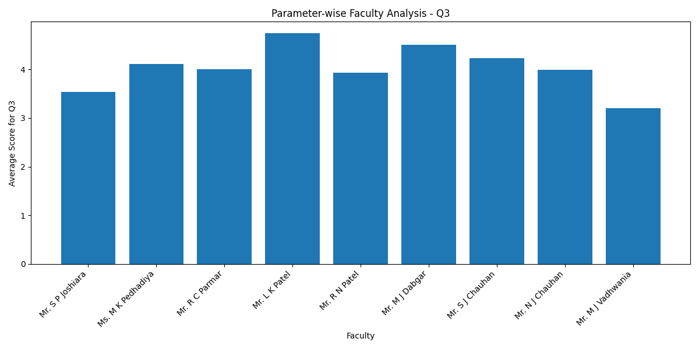

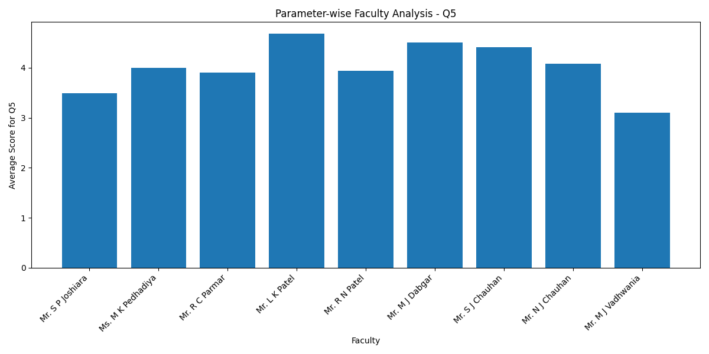

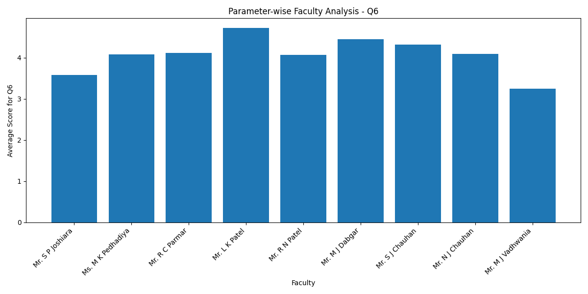

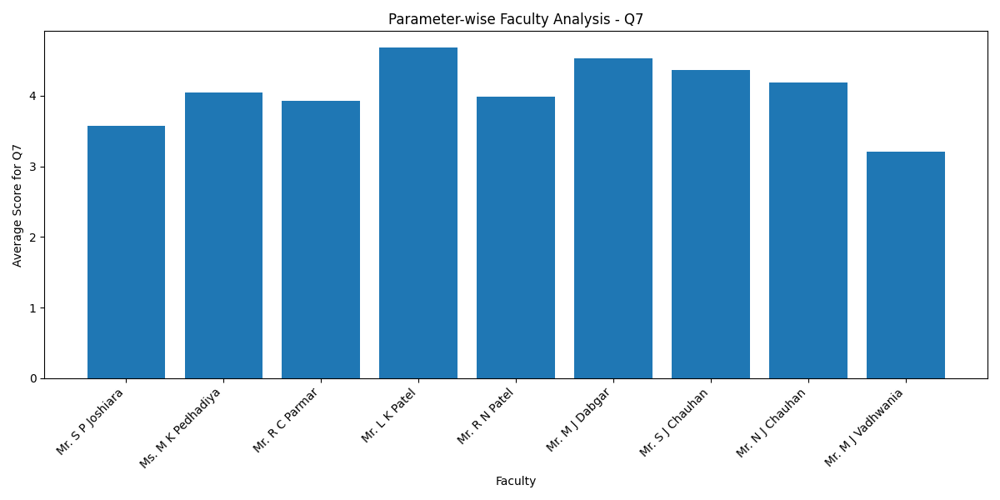

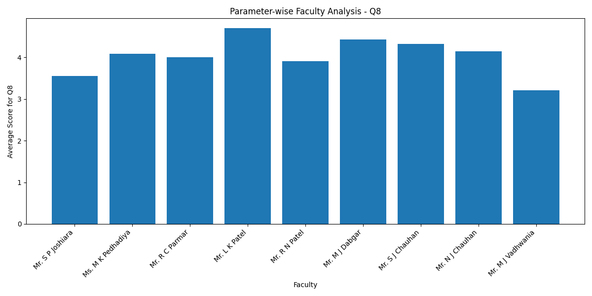

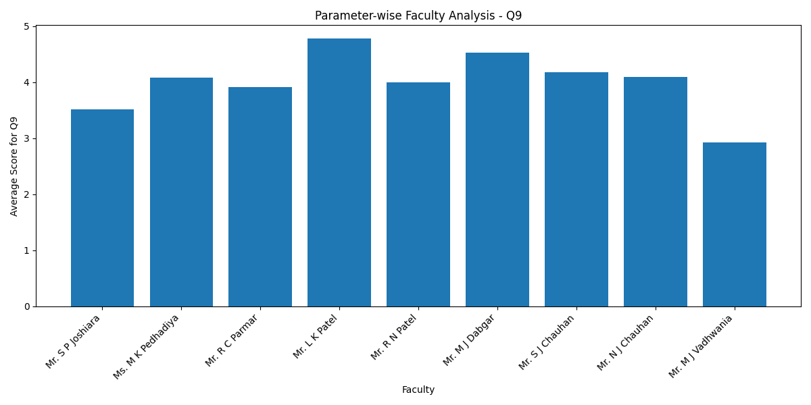

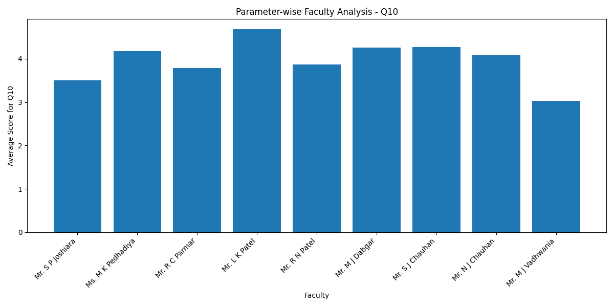

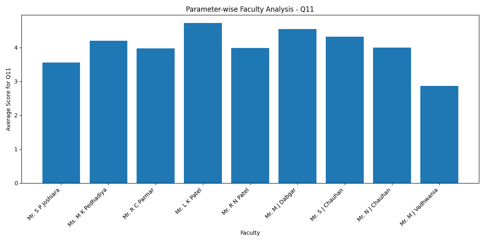

