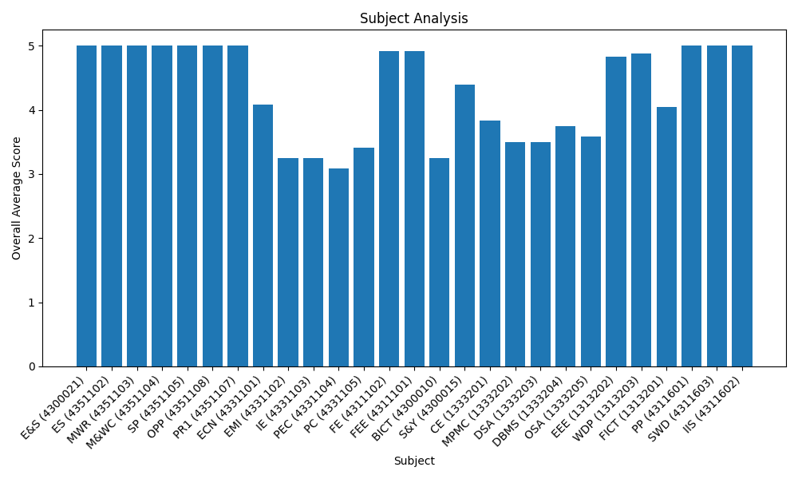

# Student Feedback Analysis Report

## Assessment Parameters & Rating Scale

### Assessment Parameters

- **Q1 Syllabus Coverage:** Has the Teacher covered entire Syllabus as prescribed by University/ College/ Board?
- **Q2 Topics Beyond Syllabus:** Has the Teacher covered relevant topics beyond syllabus?
- **Q3 Pace of Teaching:** Pace on which contents were covered?
- **Q4 Practical Demo:** Support for the development of Student's skill (Practical demonstration)
- **Q5 Hands-on Training:** Support for the development of Student's skill (Hands-on training)
- **Q6 Technical Skills of Teacher:** Effectiveness of Teacher in terms of: Technical Skills
- **Q7 Communication Skills of Teacher:** Effectiveness of Teacher in terms of: Communication Skills
- **Q8 Doubt Clarification:** Clarity of expectations of students
- **Q9 Use of Teaching Tools:** Effectiveness of Teacher in terms of: Use of teaching aids
- **Q10 Motivation:** Motivation and inspiration for students to learn
- **Q11 Helpfulness of Teacher:** Willingness to offer help and advice to students
- **Q12 Student Progress Feedback:** Feedback provided on Student's progress

### Rating Scale

Rating | Description
-------|------------
1      | Very Poor
2      | Poor
3      | Average
4      | Good
5      | Very Good

## Feedback Analysis

## Faculty Analysis

### Mr. S P Joshiara

- Overall Average: 4.27

| Subject | Average Score |
|---------|---------------|
| E&S (4300021) | 5.00 |
| EMI (4331102) | 3.25 |
| FICT (1313201) | 3.83 |
| S&Y (4300015) | 5.00 |

### Ms. M K Pedhadiya

- Overall Average: 4.27

| Subject | Average Score |
|---------|---------------|
| ES (4351102) | 5.00 |
| PC (4331105) | 3.42 |
| DBMS (1333204) | 3.75 |
| WDP (1313203) | 4.92 |

### Mr. R C Parmar

- Overall Average: 4.52

| Subject | Average Score |
|---------|---------------|
| MWR (4351103) | 5.00 |
| IE (4331103) | 3.25 |
| WDP (1313203) | 4.83 |
| SWD (4311603) | 5.00 |

### Mr. L K Patel

- Overall Average: 4.70

| Subject | Average Score |
|---------|---------------|
| M&WC (4351104) | 5.00 |
| OPP (4351108) | 5.00 |
| FE (4311102) | 4.92 |
| OSA (1333205) | 3.58 |
| IIS (4311602) | 5.00 |

### Mr. R N Patel

- Overall Average: 4.62

| Subject | Average Score |
|---------|---------------|
| SP (4351105) | 5.00 |
| ECN (4331101) | 4.08 |
| BICT (4300010) | 4.92 |
| EEE (1313202) | 4.83 |
| FICT (1313201) | 4.25 |

### Mr. M J Dabgar

- Overall Average: 4.50

| Subject | Average Score |
|---------|---------------|
| PR1 (4351107) | 5.00 |
| DSA (1333203) | 3.50 |
| PP (4311601) | 5.00 |

### Mr. S J Chauhan

- Overall Average: 3.46

| Subject | Average Score |
|---------|---------------|
| PEC (4331104) | 3.08 |
| CE (1333201) | 3.83 |

### Mr. N J Chauhan

- Overall Average: 4.38

| Subject | Average Score |
|---------|---------------|
| FEE (4311101) | 4.92 |
| MPMC (1333202) | 3.50 |
| S&Y (4300015) | 4.08 |
| IIS (4311602) | 5.00 |

### Mr. M J Vadhwania

- Overall Average: 3.56

| Subject | Average Score |
|---------|---------------|
| BICT (4300010) | 1.58 |
| S&Y (4300015) | 4.08 |
| IIS (4311602) | 5.00 |

## Subject Analysis

### E&S (4300021)

- Overall Average: 5.00

| Faculty | Average Score |
|---------|---------------|
| Mr. S P Joshiara | 5.00 |

### ES (4351102)

- Overall Average: 5.00

| Faculty | Average Score |
|---------|---------------|
| Ms. M K Pedhadiya | 5.00 |

### MWR (4351103)

- Overall Average: 5.00

| Faculty | Average Score |
|---------|---------------|
| Mr. R C Parmar | 5.00 |

### M&WC (4351104)

- Overall Average: 5.00

| Faculty | Average Score |
|---------|---------------|
| Mr. L K Patel | 5.00 |

### SP (4351105)

- Overall Average: 5.00

| Faculty | Average Score |
|---------|---------------|
| Mr. R N Patel | 5.00 |

### OPP (4351108)

- Overall Average: 5.00

| Faculty | Average Score |
|---------|---------------|
| Mr. L K Patel | 5.00 |

### PR1 (4351107)

- Overall Average: 5.00

| Faculty | Average Score |
|---------|---------------|
| Mr. M J Dabgar | 5.00 |

### ECN (4331101)

- Overall Average: 4.08

| Faculty | Average Score |
|---------|---------------|
| Mr. R N Patel | 4.08 |

### EMI (4331102)

- Overall Average: 3.25

| Faculty | Average Score |
|---------|---------------|
| Mr. S P Joshiara | 3.25 |

### IE (4331103)

- Overall Average: 3.25

| Faculty | Average Score |
|---------|---------------|
| Mr. R C Parmar | 3.25 |

### PEC (4331104)

- Overall Average: 3.08

| Faculty | Average Score |
|---------|---------------|
| Mr. S J Chauhan | 3.08 |

### PC (4331105)

- Overall Average: 3.42

| Faculty | Average Score |
|---------|---------------|
| Ms. M K Pedhadiya | 3.42 |

### FE (4311102)

- Overall Average: 4.92

| Faculty | Average Score |
|---------|---------------|
| Mr. L K Patel | 4.92 |

### FEE (4311101)

- Overall Average: 4.92

| Faculty | Average Score |
|---------|---------------|
| Mr. N J Chauhan | 4.92 |

### BICT (4300010)

- Overall Average: 3.25

| Faculty | Average Score |
|---------|---------------|
| Mr. R N Patel | 4.92 |
| Mr. M J Vadhwania | 1.58 |

### S&Y (4300015)

- Overall Average: 4.39

| Faculty | Average Score |
|---------|---------------|
| Mr. M J Vadhwania | 4.08 |
| Mr. N J Chauhan | 4.08 |
| Mr. S P Joshiara | 5.00 |

### CE (1333201)

- Overall Average: 3.83

| Faculty | Average Score |
|---------|---------------|
| Mr. S J Chauhan | 3.83 |

### MPMC (1333202)

- Overall Average: 3.50

| Faculty | Average Score |
|---------|---------------|
| Mr. N J Chauhan | 3.50 |

### DSA (1333203)

- Overall Average: 3.50

| Faculty | Average Score |
|---------|---------------|
| Mr. M J Dabgar | 3.50 |

### DBMS (1333204)

- Overall Average: 3.75

| Faculty | Average Score |
|---------|---------------|
| Ms. M K Pedhadiya | 3.75 |

### OSA (1333205)

- Overall Average: 3.58

| Faculty | Average Score |
|---------|---------------|
| Mr. L K Patel | 3.58 |

### EEE (1313202)

- Overall Average: 4.83

| Faculty | Average Score |
|---------|---------------|
| Mr. R N Patel | 4.83 |

### WDP (1313203)

- Overall Average: 4.88

| Faculty | Average Score |
|---------|---------------|
| Ms. M K Pedhadiya | 4.92 |
| Mr. R C Parmar | 4.83 |

### FICT (1313201)

- Overall Average: 4.04

| Faculty | Average Score |
|---------|---------------|
| Mr. S P Joshiara | 3.83 |
| Mr. R N Patel | 4.25 |

### PP (4311601)

- Overall Average: 5.00

| Faculty | Average Score |
|---------|---------------|
| Mr. M J Dabgar | 5.00 |

### SWD (4311603)

- Overall Average: 5.00

| Faculty | Average Score |
|---------|---------------|
| Mr. R C Parmar | 5.00 |

### IIS (4311602)

- Overall Average: 5.00

| Faculty | Average Score |
|---------|---------------|
| Mr. L K Patel | 5.00 |
| Mr. M J Vadhwania | 5.00 |
| Mr. N J Chauhan | 5.00 |

## Semester Analysis

| Semester | Average Score |
|----------|---------------|
| EC - Sem 5 | 4.99 |
| EC - Sem 3 | 4.26 |
| EC - Sem 1 | 4.35 |
| ICT - Sem 3 | 4.30 |
| ICT - Sem 1 | 3.56 |
| IT - Sem 1 | 4.19 |

## Branch Analysis

| Branch | Average Score |
|--------|---------------|
| EC | 4.56 |
| ICT | 3.73 |
| IT | 4.19 |

